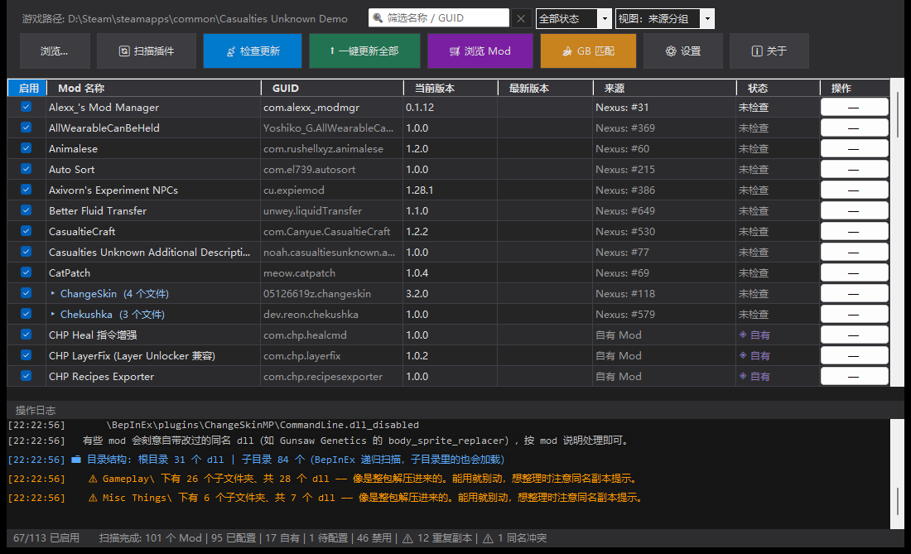
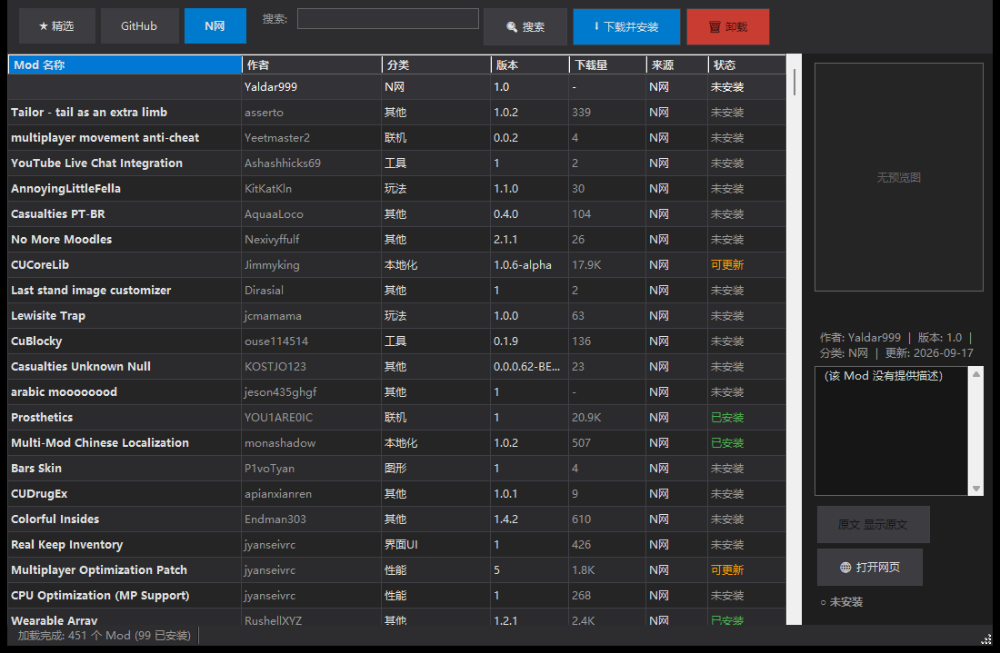

# CU Mod 更新器

**Casualties: Unknown** 的 BepInEx Mod 管理器：一站检查更新、浏览下载新 Mod、整理插件目录。

> A BepInEx mod manager for *Casualties: Unknown* — update checking, mod browsing
> (Nexus / GitHub / GameBanana) and plugin folder cleanup, in one dark-theme Windows app.





---

## 它解决什么问题

`Casualties: Unknown` 的 Mod 生态分散在 **N 网、GitHub、GameBanana** 三处，作者更新频繁，
手动一个个对版本、下载、解压、替换非常耗人。这个工具把这些合成一件事：
**打开就能看到哪些 Mod 装了、哪些该更新、一键更完。**

顺带解决了几个很实际的麻烦：

- N 网描述是**英文 + BBCode 富文本**，看着累 → 内置翻译，清洗后翻成中文
- 同一目录里经常躺着**多个版本的旧 dll**，谁在用、哪个是残留看不出来 → 目录树 + 重复副本标记
- 禁用 Mod 要手动改文件名（BepInEx 的 `_disabled` 约定）→ 复选框点一下，目录可整批递归开关

## 主要功能

### 更新管理
- **自动识别更新源**：解析插件元数据（Mono.Cecil），结合社区元数据自动匹配 N 网 / GitHub 来源，免手动填写
- **批量检查更新**：GitHub Releases + Nexus API 双通道版本比对
- **一键更新 / 一键更新全部**：下载、解压、替换，更新前自动备份
- **回滚**：右键从备份恢复任意旧版本

### 插件目录管理
- **双视图**：`来源分组`（更新视角）与 `文件夹分组`（整理视角，目录树）
- **三态复选框**：全启用 ✓ / 全禁用 / 混合，目录节点可**递归**批量开关（含所有子目录）
- **重复副本检测**：同目录下同名 dll 的新旧副本标注出来，便于清理
- **同名冲突检测**：不同 Mod 撞了同一个 dll 名会告警
- **隔离区**：禁用时若目标名被旧副本占着，可把旧副本移入 `BepInEx\.cleanup\`（**不删除**，可随时移回）后继续

### Mod 浏览器（浏览 / 下载 / 安装）
- **N 网**：全量清单（400+ 条，来自社区元数据），含作者、版本、下载量、预览图、完整描述
- **GitHub**：多组查询合并搜索（100+ 仓库），选中时补查 Release，可直接下载资产
- **精选 / GameBanana**：实时列表 + 内置精选，条目自动用元数据补全缺失字段
- **一键下载安装**：`.dll` 直装 / `.zip` 自动解压
- **富文本清洗 + 翻译**：BBCode / HTML 洗掉后再显示与翻译，支持中文搜索与中文译名

## 快速开始

### 方式一：下载现成 exe（推荐）

到 [Releases](../../releases) 下载 `CU-ModUpdater.exe`，放进任意目录双击运行。

- **单文件发布版**，不依赖 .NET 运行时
- 首次启动会在设置里让你确认游戏路径（支持自动检测 Steam / 常见安装位置）

### 方式二：从源码构建

```bash
git clone https://github.com/Luncot/cu-mod-updater.git
cd cu-mod-updater

# 直接运行
dotnet run -c Release

# 或发布单文件 exe
dotnet publish -c Release -r win-x64 --self-contained false \
  -p:PublishSingleFile=true -p:IncludeNativeLibrariesForSelfExtract=true
```

> 需要 .NET 8 SDK（构建）/ .NET 8 Desktop Runtime（非自包含运行）。

## 使用指南

### 首次启动

1. 确认游戏路径（右侧「设置」可改）
2. 点击 **扫描插件**，程序会解析 `BepInEx/plugins/` 下所有插件
3. 大部分 Mod 的更新源会被**自动识别**（来自社区元数据），未识别的可右键手动配置
4. 点击 **检查更新** 批量比对版本

### 可选配置（提升体验）

| 配置 | 作用 | 获取方式 |
|---|---|---|
| Nexus API Key | 启用 N 网浏览与版本检查 | nexusmods.com → Settings → API |
| GitHub Token | API 限额 60/h → **5000/h** | GitHub → Settings → Developer settings → Personal access tokens |

> 两者都是**可选**的：不填也能用（走社区元数据 + 匿名 GitHub 接口），填了更顺。

### 整理插件目录

切到右上角 **视图：文件夹分组**：

- 点目录前的箭头展开，点 **名称** 折叠/展开
- 勾选目录的复选框 = **整个目录（含子目录）批量启用/禁用**
- 橙色的 `〔重复副本〕`、紫色的 `〔同名冲突〕` 是需要留意的行
- 目录里启用的文件显示为亮色，禁用的整行压暗

### Mod 浏览器

点主界面 **浏览 Mod** 打开。三个来源各有侧重：

- **N 网**：想找新 Mod 从这里翻，400+ 条全量清单，点开有中文翻译
- **GitHub**：找源码仓库 / 最新版，选中后会自动补查 Release 变成可下载
- **精选**：社区常用 Mod 的精选集

选中条目后可 **下载并安装**、**打开网页**；描述可点 **翻译** 转成中文（结果会缓存）。

## 命令行参数

除了 GUI，也支持无界面模式，方便脚本调用与排查问题：

```bash
# 扫描插件并输出 JSON（供脚本批量比对）
CU-ModUpdater.exe --scan "D:\Steam\steamapps\common\Casualties Unknown Demo"

# 扫描 + 检查更新 + 打印结果（无 UI，冒烟测试用）
CU-ModUpdater.exe --check "D:\Steam\steamapps\common\Casualties Unknown Demo"

# 启动后直接打开 Mod 浏览器（可指定标签页: curated / github / nexus）
CU-ModUpdater.exe --browser nexus

# 打印某个 N 网 Mod 在浏览器里的显示效果（核对富文本清洗与字段补全）
CU-ModUpdater.exe --preview 324
```

## 文件位置

| 内容 | 位置 |
|---|---|
| 配置 | `%APPDATA%\CU-ModUpdater\modupdater_config.json` |
| 社区元数据缓存 | `%APPDATA%\CU-ModUpdater\casualties_manageable.json` |
| GitHub README 缓存 | `%APPDATA%\CU-ModUpdater\gh_readme\` |
| 更新备份 | `游戏目录\BepInEx\plugins\.backup\` |
| 隔离区（手动清理） | `游戏目录\BepInEx\.cleanup\` |

## 已知限制

- **游戏运行时不要更新 Mod**：dll 被占用，替换会失败
- **N 网部分文件需要 Premium**：免费账号可浏览与检查版本，个别文件走 N 网自身的下载限制
- **GitHub 匿名限额 60 次/小时**：抓描述会比较吃紧，配 Token 可到 5000/h
- **`raw.githubusercontent.com` 在部分地区不可达**：程序优先走 `api.github.com`，该域名只作兜底
- **N 网图片是 WebP**：Win10 1809+ / Win11 自带解码器；老系统上预览图可能显示不了

## 技术栈

- **C# / .NET 8 WinForms** —— 深色主题 GUI
- **Mono.Cecil** —— 解析程序集元数据（不加载 dll 到内存，避免被反作弊盯上）
- **System.Text.Json** —— 配置与元数据
- **WPF / WIC**（仅用于）解码 WebP 预览图

## 项目结构

```
CU-ModUpdater/
├── Program.cs                       # 入口 + 命令行模式
├── Models/
│   ├── ModInfo.cs                   # Mod 数据模型 + 版本比较
│   ├── ModSource.cs                 # 更新来源配置
│   ├── ModUpdaterConfig.cs          # 全局配置
│   └── ModListing.cs                # 浏览器列表项
├── Services/
│   ├── PluginScanner.cs             # 扫描 BepInEx 插件目录
│   ├── CasualtiesManageableService.cs  # 社区元数据（全量 Mod 清单 / 来源匹配）
│   ├── ModGrouper.cs                # 来源分组 + 文件夹分组
│   ├── ModCatalog.cs                # 元数据 → 浏览器清单 + 分类归类
│   ├── Markup.cs                    # BBCode / HTML 富文本清洗
│   ├── ConfigManager.cs             # 配置读写与迁移
│   ├── GitHubChecker.cs / NexusChecker.cs   # 更新检查
│   ├── GitHubBrowser.cs             # GitHub 搜索 / Release / README
│   ├── NexusBrowser.cs              # N 网榜单与详情
│   ├── GameBananaBrowser.cs         # GameBanana 列表
│   ├── ModInstaller.cs              # 下载安装新 Mod
│   ├── UpdateManager.cs             # 下载 / 备份 / 替换 / 回滚
│   ├── TranslationService.cs        # 英中翻译（词典 + 在线 + 缓存）
│   └── NexusCookieDownloader.cs     # N 网文件下载
├── Forms/
│   ├── MainForm.cs                  # 主窗口
│   ├── ModBrowserForm.cs            # Mod 浏览器
│   ├── SettingsForm.cs              # 设置
│   └── ModSourceDialog.cs           # 来源配置
└── docs/                            # 截图
```

## 数据来源与致谢

- **[Metadata-generator](https://github.com/jimmyking9999999)**（jimmyking9999999）—— 社区维护的
  Casualties: Unknown Mod 元数据库，本工具的「自动识别来源」与全量清单都建立在它之上
- **Nexus Mods / GitHub / GameBanana** —— Mod 与更新信息
- 翻译使用 Google Translate 非官方接口 + MyMemory 兜底 + 本地游戏术语词典

## 许可

[MIT](LICENSE)
